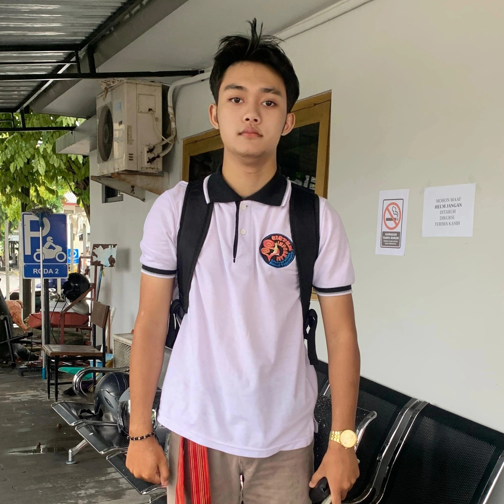

# Dimas Oktavian Prasetyo - Software Engineer and Digital Forensics Specialist

<!--  -->

## About Me

Hello! My name is **Dimas Oktavian Prasetyo**, and I am passionate about leveraging technology to solve real-world problems. I was born in **Pekalongan, Central Java** on **October 31, 2004**. Currently, I am pursuing a **Bachelor's degree in Information Systems (S1)** at **Respati University Yogyakarta**, and I am currently in my **sixth semester**. From an early age, I’ve been captivated by how technology can shape and transform the world around us. My interest in technology began with curiosity, which has grown into a deep commitment to using innovation to create impactful solutions.

I am a **Junior Software Engineer / Fullstack Developer**, with a wide array of interests spanning the fields of **Data Science**, **Cybersecurity**, **Computational Forensics**, and **Artificial Intelligence**. My goal is to combine my technical expertise with a focus on addressing the evolving challenges that come with our digital age.

In addition to my academic journey, I am the **Head of Founder Associate Team** at **Blue Skyland**, a forward-thinking technology startup based in **Yogyakarta**. As the founder and lead, I have had the opportunity to immerse myself in the entrepreneurial process—developing innovative technology solutions and understanding the role that digital transformation plays in the success of businesses today.

My technical expertise has been cultivated through hands-on work in both academic and practical settings, where I am always striving to push the boundaries of my knowledge and contribute to cutting-edge projects that provide real value to businesses, communities, and individuals. I am deeply motivated by the opportunity to solve complex problems using technology, with the ultimate aim of improving lives through smarter, more efficient systems.

The world of technology is constantly evolving, and I aim to remain at the forefront of these changes. I believe in **continuous learning**, **collaboration**, and **mentorship** as essential components of personal and professional growth. I am always open to connecting with like-minded individuals to explore how we can work together to make a lasting impact.

Let’s push the boundaries of what’s possible and explore the future of digital transformation together!

I am a **Junior Software Engineer / Fullstack Developer**, and my areas of interest and expertise include:

- **Data Science**
- **Cybersecurity**
- **Computational Forensics**
- **Artificial Intelligence / Machine Learning**
- **Cloud Computing**

Additionally, I am the **Head of Founder Associate Team** at **Blue Skyland**, a startup based in **Yogyakarta**. Through this experience, I have come to understand the critical importance of **technological development** in today’s digital era to tackle various challenges.

## Personal Philosophy

I believe in **continuous learning** and **collaboration** as keys to innovation. I always strive to keep learning new skills and technologies while working with others to create meaningful solutions. My passion lies in solving complex problems, and I take pride in making technology accessible and useful for everyone.

## Skills

### 💻 **Software Development**
- Expertise in web application development using full-stack technologies like **React.js**, **Node.js**, **Express.js**, and **PHP Laravel 11**.
### 📊 **Data Science or Big Data Analysis**
- Skilled in data processing, analysis, and visualization using **Python** and **R**. Experienced in machine learning models, data cleaning, and feature engineering.
### 🔐 **Cybersecurity Specialist in Malware**
- Knowledge of security protocols, encryption, and ethical hacking techniques to protect sensitive information.
### 🕵️‍♂️ **Computational Forensics (Digital Forensics Investigation)**
- Experienced with digital forensics tools and techniques for investigating cyberattacks, post-breach analysis, and forensic examination of electronic devices.
### 🤖 **Artificial Intelligence (AI)**
- Strong understanding of machine learning algorithms, natural language processing (NLP), and neural networks. Skilled in using frameworks like TensorFlow and PyTorch for developing AI solutions.
### ☁️ **Cloud Computing**
- Proficient in cloud platforms such as Amazon Web Services (AWS), Microsoft Azure, and Google Cloud Platform (GCP). Experienced in deploying, scaling, and managing cloud-based applications and services, with a focus on serverless architectures and cloud security.

## Experience

### **Head of Founder Associate Team** – Blue Skyland Business of Corporation 
*Yogyakarta, Indonesia*  
**2025 - Present**  
- Leading and managing a team to develop cutting-edge software solutions that help businesses streamline processes and enhance digital transformation.
- Developing strategic plans, collaborating with clients, and overseeing the implementation of technology-driven solutions across Indonesia.

### **Junior Software Engineer / Fullstack Developer** – Ruangguru.com (MSIB Independent Studies Batch 7)  
*Jakarta, Indonesia*  
**From September 2024 to December 2024**  
- Contributed to the development of educational web and mobile applications using the **MERN** stack (MongoDB, Express, React, Node).
- Worked closely with cross-functional teams to design, build, and deploy scalable and efficient solutions.

## Achievements & Certifications

- **Microsoft Certified: Azure Fundamentals**
- **Google IT Support Professional Certificate**
- **Top 5 Finalist in Yogyakarta Coding Challenge 2024** – Recognized for creating an innovative solution for local businesses.
- **Speaker at Yogyakarta Tech Conference 2025** – Discussing the future of cybersecurity and digital forensics.

## Projects

### **Blue Skyland**  
- **Role**: Founder & Team Lead  
- **Technology**: **React.js**, **Node.js**, **Angular**, **PHP Laravel 11**, **Python**, **ORACLE**, **MongoDB**, **Docker**, and **AWS**  
- **Description**: As a founder, I led the development of several technology-driven projects that help businesses transition into the digital era. These projects focus on automating business processes and improving data management.

### **Cybersecurity Application Development**  
- **Role**: Lead Developer  
- **Technology**: **Python**, **OpenCV**, **Scikit-learn**, **TensorFlow**  
- **Description**: Created an application to detect and mitigate potential security threats on networks using machine learning algorithms for anomaly detection.

## Hobbies & Passion

When I'm not coding, you can find me **exploring AI research and Computer Forensics**, **playing football**, or **learning new programming languages**. Coding is not just a job for me; it's a passion that drives me every day. I enjoy the process of solving complex problems and the thrill of bringing ideas to life through code. Whether it's experimenting with new algorithms, building innovative software, or learning new technologies, I'm always excited to dive deeper into the world of programming.

In addition, I also enjoy **mentoring** young developers and sharing knowledge with others to help them grow in the tech industry. Providing insights and guidance to those who are just starting their journey in technology is an incredibly fulfilling experience. I believe that sharing knowledge helps build a stronger, more supportive community of developers. This combination of technical skills and mentoring continues to motivate me to grow and connect with the broader tech community.

## Contact

Feel free to reach out to me through the following channels:

  
  
  
  

---

Thank you for visiting my profile. Let’s connect and talk about technology, innovation, and the future of digital transformation!
